## Overview

The lab module introduces users to a brand new Teams AI Library. Participants will have the opportunity to run the provided sample code and witness the seamless integration of LLM AI within a Teams Bot. By leveraging LLM AI, the bot will be able to engage in natural and intelligent conversations, making it an ideal tool for enhancing user experiences in various scenarios. This lab module aims to provide developers with hands-on experience in building AI-powered Teams Bots.

## Exercise 1: Setting up the Project

In this exercise you will be setting up the sample bot.

1. Log In to the machine with the password found in the `Resources` tab.

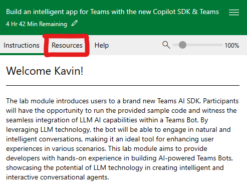

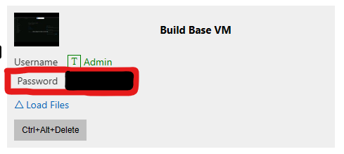

2. Load `Visual Studio Code` from the Desktop by double clicking this icon.


3. The project `TravelBot` should already be configured. You can verify by confirming the folder is open in the side panel.

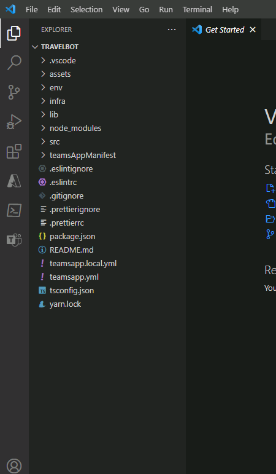

4. Navigate to the `env/.env.local.user` file. It should look like this:

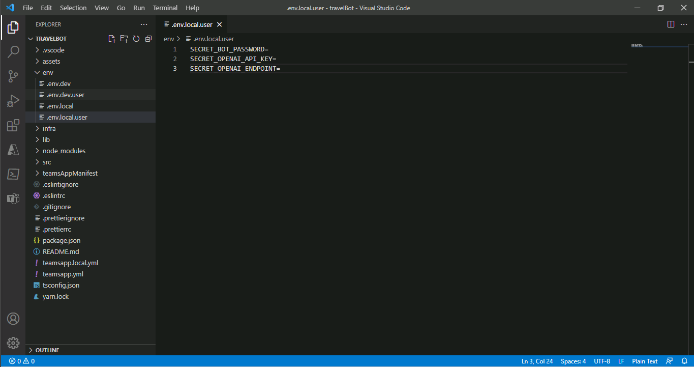

Now go to the `Resources` tab and grab the `Key` and `Endpoint` from the `Azure Portal` section. Set the value in the following way:

```
SECRET_OPENAI_API_KEY=Key
SECRET_OPENAI_ENDPOINT=Endpoint
```

So if the `Key` was `9bc5c422-0e6f-40d3-9fb7-880f99d2f390`. And `Endpoint` was `https://lab132.openai.azure.com`. The file should look like this:

```
SECRET_BOT_PASSWORD=
SECRET_OPENAI_API_KEY=9bc5c422-0e6f-40d3-9fb7-880f99d2f390
SECRET_OPENAI_ENDPOINT=https://lab132.openai.azure.com/
```

No need to set `SECRET_BOT_PASSWORD` variable.

## Exercise 2: Starting the bot

At this point the project and environment variables should be properly configured. We will go ahead and start the bot and sideload it into Teams using the Teams Toolkit extension in VS Code. Here are the steps to do that:

With the project open in Visual Studio and Exercise 1 completed, proceed to press `F5` on the keyboard. This will kick start the Teams Toolkit process of provisioning the required Azure resources, Starting the local bot web server, configuring the local tunnel, and sideloading the bot into Teams.

1. First, you will be required by Teams toolkit to sign in with a Microsoft account. The following popup will show:

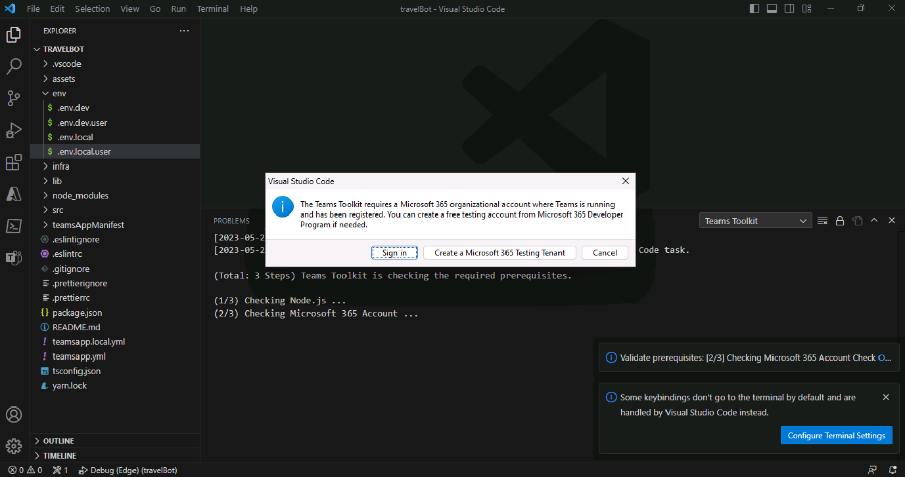

2. Click "Sign In" and a web browser should open with the Microsoft login page:

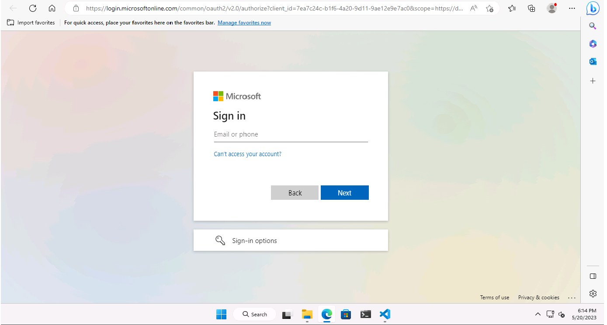

3. Now use the credentials provided in the `Resources` tab. You should find the `username` and `password` under `User Credentials`. Fill those in and click "Next". If there are any "Action Required" prompts in the login flow simply click "Ask Later". Once you have successfully logged in you should see the following page:

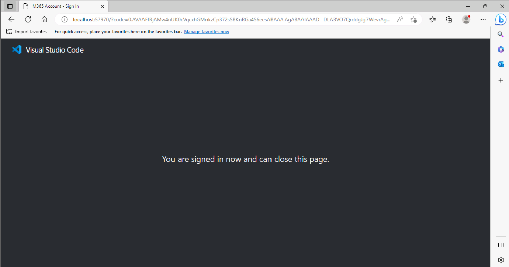

You can close the tab.

4. Now the Team's toolkit will start the local tunnel, bot webserver and attempt to sideload the bot to Teams. In this step a web browswer will open up and you will be asked to provide Microsoft credentials again. Simply provide the same credentials from Step 3.

5. Once you login, you should see this:

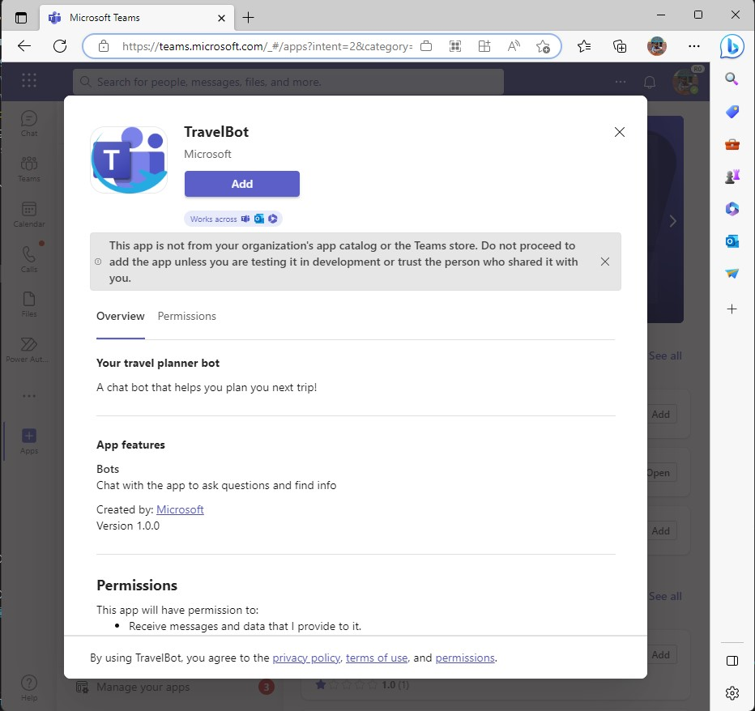

Proceed to Add the bot in Teams.

6. Viola! You should be able to send a message to the bot:

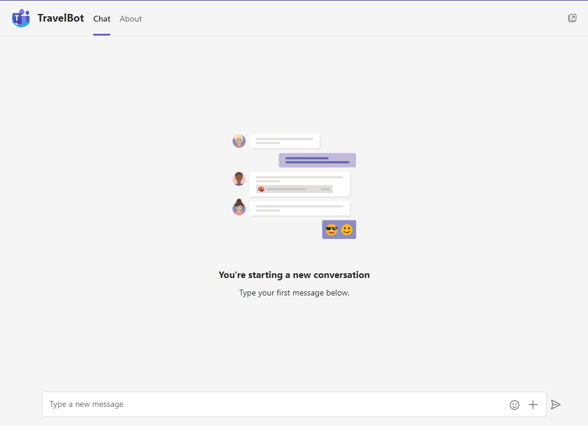

## Exercise 3: Microsoft Teams Conversational Bot with the model - Travel Bot

This is a conversational bot for Microsoft Teams that thinks it's is an expert in the travel industry with over 20 years experience. It will ask the user the destination they're planning to visit and give them a detailed description of their destination and suggest some things to see and do. 

The bot uses the `text-davinci-003` model to chat with Teams users and respond in a polite and respectful manner, staying within the scope of the conversation.

This sample illustrates basic conversational bot behavior in Microsoft Teams. The bot is built to allow the model to facilitate the conversation on its behalf, using only a natural language prompt file to guide it.

### Step 1: Interact with the Bot

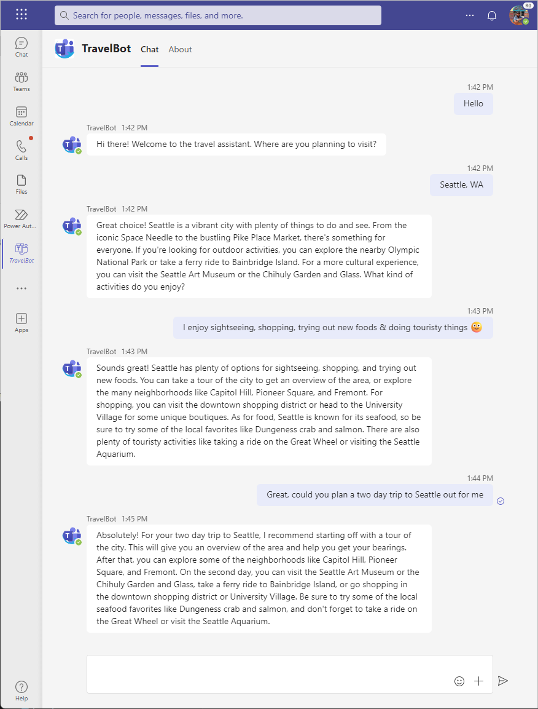

In the above example you can see the Travel bot gave suggestions for things to do based on the activity preference provided.

Play around with the Travel bot. Here are some things you can ask it to do:

1. Ask for recommandations for places to visit.
    - "What are nice sightseeing spots for tourists in Seattle?"
    - "What are must do things in a Europe trip?"
    - "What are the famous art galleries in New York?"
2. Plan out a trip.
    - "Come up with a detailed plan for a two day trip to Los Angeles, California. I love trying new restaurants and shopping."

##### This bot can do more than help you travel...
Even though this is a travel bot, it will be able to answer more than just travel related questions. Try asking it one of the following questions:

1. "Tell me about the upcomming US Elections"
2. "When was Canada founded?"

This is because the bot is simply a proxy between the user and OpenAI model `text-davinci-003`. Obviously this is not a good thing since the conversation can go out of scope. We will see later on in this lab how to prevent this from happening. To do that we must first understand how this works.

### Step 2: How it Works

In simple terms, the users message is sent to the bot server, and then injected into a prompt template and passed into the `text-davinci-003` model. The response is then returned to the user in Teams. 

Open the `src/promps/chat/skprompt.txt` file to find descriptive prompt engineering that, in plain language and with minor training, instructs the model how the bot should conduct itself and facilitate conversation:

#### let's take a look the prompt

```
The following is a conversation with an AI assistant. 
The assistant is an expert in the travel industry with over 20 years experience.
The assistant should greet the user and ask them the destination they're planning to visit.
Upon learning the users destination, the assistant should give them a detailed description of their destination and suggest some things to see and do.
The assistant should ask the user what kind of activities they enjoy or places they like to see so they can better tailor their recommendations to the user.

{{$history}}
User: {{$input}}
Assistant: 
```

Note that `{{$history}}` populates the conversation history and `{{$input}}` populates the user's latest message into the prompt. These values are retrieved from the program in runtime.

It is important to pass in the conversation history to the model since its response will depend solely on the prompt passed into the model. Here's an example of how the model uses the historical context:

```
USER: Hello.
AI: Hi! Welcome to the travel assistant. Where are you planning to visit?
USER: Japan
AI: Great choice! Japan is a beautiful country with a rich culture and history. There are many things to see and do in Japan, from visiting ancient temples and shrines to exploring the bustling cities. What kind of activities do you enjoy?
USER: I like to eat Sushi.
AI: There are many famous Sushi restaurants all over Japan. Which cities are you planning to visit?
```

Notice that the model remembered the user's specified destination Japan when asking which cities the user is planning to visit in the 6th message.

##### View rendered prompt in every interaction

In the Visual Studio code terminal, you can see the rendered prompt that is passed to the model in every interaction. Notice how the history and user's input is injected in the end of the prompt.

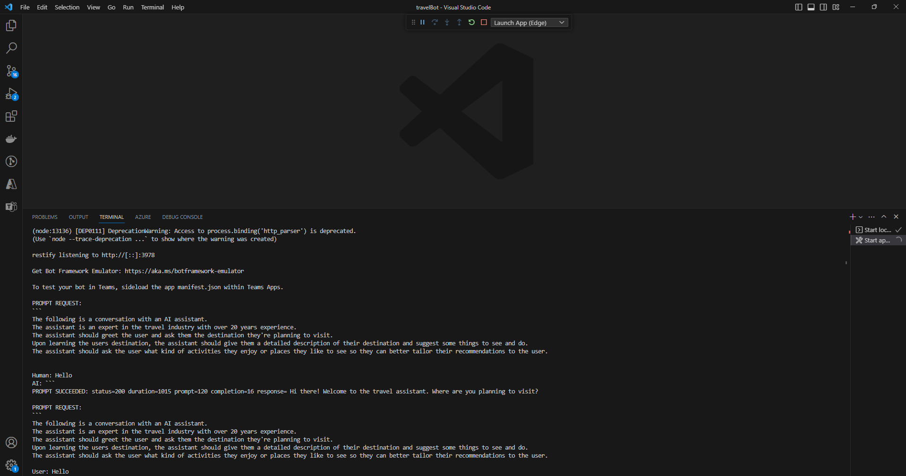

#### let's take a look at the code

Notice that outside of the `\history` and `\clearhistory` message activity handler, the `index.ts` file relies on the model for all its natural language modelling - no code is specifically written to handle language processing. Rather, the AI Module is designed to handle this for you:

```typescript
type ApplicationTurnState = DefaultTurnState<DefaultConversationState, DefaultUserState, DefaultTempState>;

const planner = new AzureOpenAIPlanner({
    apiKey: process.env.OPENAI_API_KEY,
    endpoint: process.env.OPENAI_ENDPOINT,
    defaultModel: 'text-davinci-003',
    logRequests: true,
})

const promptManager = new DefaultPromptManager<ApplicationTurnState>(path.join(__dirname, '../src/prompts'));

// Define storage and application
const storage = new MemoryStorage();

// Define the application instance
const app = new Application<ApplicationTurnState>({
    storage,
    ai: {
        planner,
        promptManager,
        prompt: 'chat', // refers to the `src/prompts/chat` folder
        history: { // the AI module manages the conversation history
            assistantHistoryType: 'text',
            maxTurns: 10, 
            maxTokens: 1000
        }
    }
});
```

Notice that in the `ai` object, the `'chat'` prompt is specified. This is a folder in the `../src/prompts` folder as defined in the `promptManager`:

```javascript
const promptManager = new DefaultPromptManager<ApplicationTurnState>(path.join(__dirname, '../src/prompts'));
```

### Step 3: Extend the prompt to prevent out of scope conversations

As we saw in Step 1, the bot is a proxy between the user and Open AI's `text-davinci-003` model. Since the prompt guides the model's behavior we have to update the prompt to instruct it to ignore out of scope messages from the user. Here's one way we can do that:

Add the following line to the `skprompt.txt` file in the `src/prompts/chat` folder before `${{history}}` and after the initial paragraph.

```
The assistant should not entertain any questions or discussions that is not travel-related, or in the expertise of a travel industry expert.
```

Now restart with node.js application by going opening the `index.ts` file in Visual Studio Code and doing `Ctrl + s`. By saving the file, the `nodemon` instance will restart the node.js application without having to run the `F5` flow. 

Once this is done, interact with the bot and try having a discussion that is not travel related (i.e out of scope):

1. "Tell me about the upcoming US elections"
2. "When was Canada founded?"

You should get a response along the lines of:

```"I'm sorry, I'm not able to answer questions that are not related to travel. Where are you planning to visit?"```

### Step 4: Extend the Travel bot send Adaptive Cards

OpenAI's GPT models like `text-davinci-003` are particular good at creating JSON objects when given a basic template. In this step, we will extend the the prompt we have so far by showing it an example of an Adaptive Card JSON we expect the model to return. Here's the updated prompt:

```json
The following is a conversation with an AI assistant. 
The assistant can respond with Adaptive Cards.
The assistant is an expert in the travel industry with over 20 years experience.
The assistant should not entertain any questions or discussions that is not travel-related, or in the expertise of a travel industry expert.
The assistant should greet the user and ask them the destination they're planning to visit.
Upon learning the users destination, the assistant should give them a detailed description of their destination and suggest some things to see and do.
The assistant should ask the user what kind of activities they enjoy or places they like to see so they can better tailor their recommendations to the user.
When the user is finished building their itinerary respond with an adaptive card based on this template. Each activity should be a separate TextBlock. Bold the activity title and include a description:
{
    "type": "AdaptiveCard",
    "version": "1.4",
    "body": [
        {
            "type": "TextBlock",
            "text": "${destination} Trip",
            "size": "large",
            "weight": "bolder"
        },
        {
            "type": "Container",
            "separator": true,
            "items": [
                {
                    "type": "TextBlock",
                    "text": "Day 1",
                    "size": "medium",
                    "weight": "bolder"
                },
                {
                    "type": "TextBlock",
                    "text": "• **Site 1** Description",
                    "wrap": true
                }
            ]
        },
        {
            "type": "Container",
            "separator": true,
            "items": [
                {
                    "type": "TextBlock",
                    "text": "Day 2",
                    "size": "medium",
                    "weight": "bolder"
                },
                {
                    "type": "TextBlock",
                    "text": "• **Site 1** Description",
                     "wrap": true
                }
            ]
        }
    ]
}

{{$history}}
Human: {{$input}}
AI: 
```

Notice that the updated prompt is the same except there's two new instructions:

1. "The assistant can respond with Adaptive Cards."
2. "When the user is finished building their itinerary respond with an adaptive card based on this template. Each activity should be a separate TextBlock. Bold the activity title and include a description: ..."

Now update your application to use the updated prompt. Simply go to the `index.ts` file and update the app instance to use `'chat-adaptiveCard'` for the prompt instead of `'chat'`:

```typescript
// Define the application instance
const app = new Application<ApplicationTurnState>({
    storage,
    ai: {
        planner,
        promptManager,
        prompt: 'chat-adaptiveCard', // updated from `chat`
        history: { // the AI module manages the conversation history
            assistantHistoryType: 'text',
            maxTurns: 10, 
            maxTokens: 1000
        }
    }
});
```

Now save the `index.ts` file and wait for the node.js application to restart. 

Once that's done, the Travel bot should return adaptive cards. Here's an example interaction:

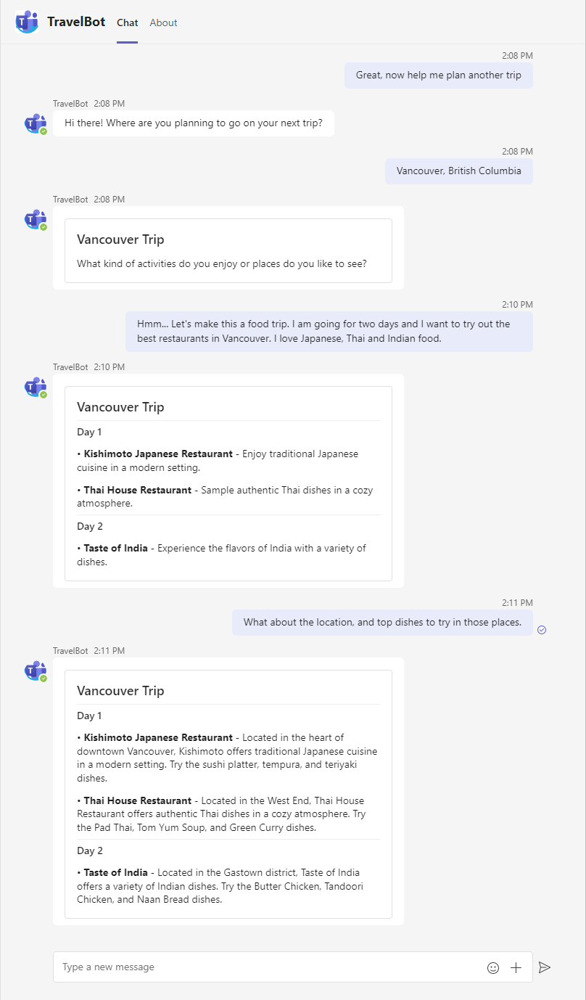

## Exercise 3: Next Steps

### Overview

Overview of the next steps.

### Take the Lab Home with You

Instructions for taking the lab home with you.
